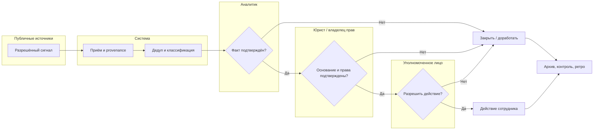

# SCH-01 · Business process (предварительно)

```mermaid
flowchart LR
 subgraph S[Публичные источники]
  A[Разрешённый сигнал]
 end
 subgraph O[Система]
  B[Приём и provenance] --> C[Дедуп и классификация]
 end
 subgraph AN[Аналитик]
  D{Факт подтверждён?}
 end
 subgraph L[Юрист / владелец прав]
  E{Основание и права подтверждены?}
 end
 subgraph R[Уполномоченное лицо]
  F{Разрешить действие?}
 end
 A --> B
 C --> D
 D -->|Нет| Z[Закрыть / доработать]
 D -->|Да| E
 E -->|Нет| Z
 E -->|Да| F
 F -->|Нет| Z
 F -->|Да| G[Действие сотрудника]
 G --> H[Архив, контроль, ретро]
 Z --> H
```
AS-IS у работодателя неизвестен. Интервью обязателен; требуется формальный BPMN по дорожкам и SLA.
