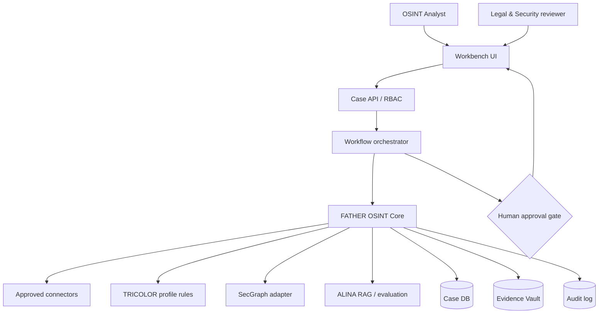

# SCH-02 · C4-inspired Context / Containers

```mermaid
flowchart TB
 Analyst[OSINT Analyst] --> UI[Workbench UI]
 Reviewer[Legal & Security reviewer] --> UI
 UI --> API[Case API / RBAC]
 API --> WF[Workflow orchestrator]
 WF --> Core[FATHER OSINT Core]
 Core --> Source[Approved connectors]
 Core --> Profile[TRICOLOR profile rules]
 Core --> Graph[SecGraph adapter]
 Core --> AI[ALINA RAG / evaluation]
 Core --> DB[(Case DB)]
 Core --> Vault[(Evidence Vault)]
 Core --> Audit[(Audit log)]
 WF --> Human{Human approval gate}
 Human --> UI
```
Схема назначения компонентов; конкретные сервисы и интерфейсы требуют отдельных спецификаций и ADR.
