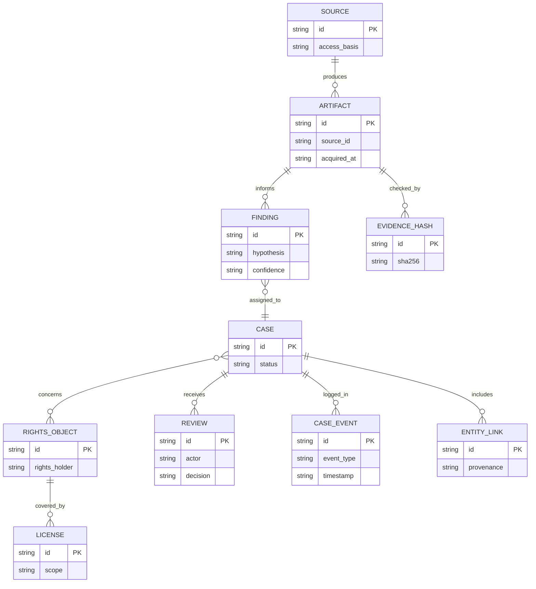

# SCH-08 · Entity relation model draft

```mermaid
erDiagram
 SOURCE ||--o{ ARTIFACT : produces
 ARTIFACT ||--o{ FINDING : informs
 FINDING }o--|| CASE : assigned_to
 RIGHTS_OBJECT ||--o{ LICENSE : covered_by
 CASE }o--o{ RIGHTS_OBJECT : concerns
 CASE ||--o{ REVIEW : receives
 CASE ||--o{ CASE_EVENT : logged_in
 ARTIFACT ||--o{ EVIDENCE_HASH : checked_by
 CASE ||--o{ ENTITY_LINK : includes
 SOURCE { string id PK string access_basis }
 ARTIFACT { string id PK string source_id string acquired_at }
 FINDING { string id PK string hypothesis string confidence }
 CASE { string id PK string status }
 RIGHTS_OBJECT { string id PK string rights_holder }
 LICENSE { string id PK string scope }
 REVIEW { string id PK string actor string decision }
 CASE_EVENT { string id PK string event_type string timestamp }
 EVIDENCE_HASH { string id PK string sha256 }
 ENTITY_LINK { string id PK string provenance }
```
Identifiers are placeholders; ERD normalized keys, retention and PII classification must be formally specified before implementation.
