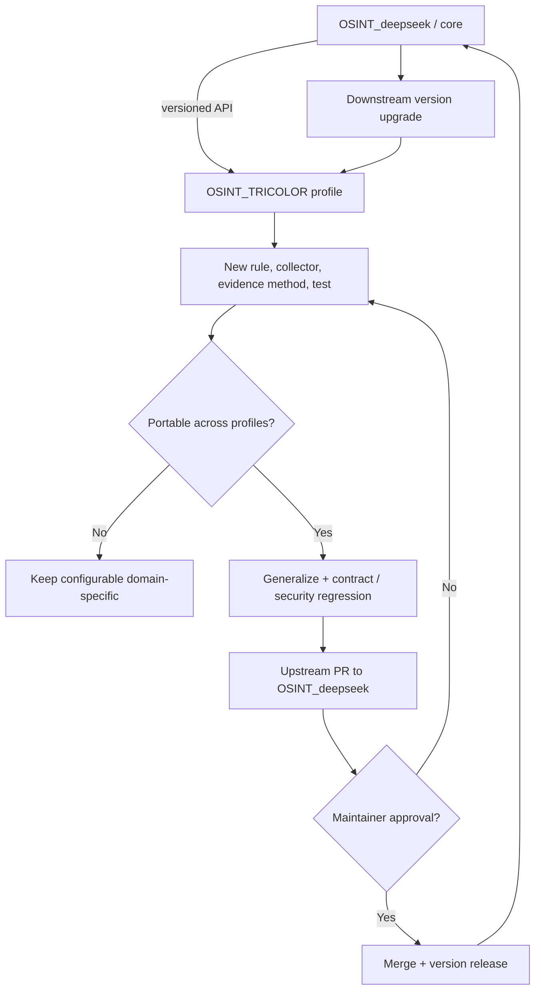

# SCH-09 · Bidirectional improvements between parent and specialized edition

```mermaid
flowchart TB
 Core[OSINT_deepseek / core] -->|versioned API| Tricolor[OSINT_TRICOLOR profile]
 Tricolor --> Candidate[New rule, collector, evidence method, test]
 Candidate --> Classify{Portable across profiles?}
 Classify -->|No| Profile[Keep configurable domain-specific]
 Classify -->|Yes| Tests[Generalize + contract / security regression]
 Tests --> PR[Upstream PR to OSINT_deepseek]
 PR --> Review{Maintainer approval?}
 Review -->|No| Candidate
 Review -->|Yes| Merge[Merge + version release]
 Merge --> Core
 Core --> Upgrade[Downstream version upgrade]
 Upgrade --> Tricolor
```
No reverse sync bypassing review. Track upstream candidates and changes with traceable IDs.
