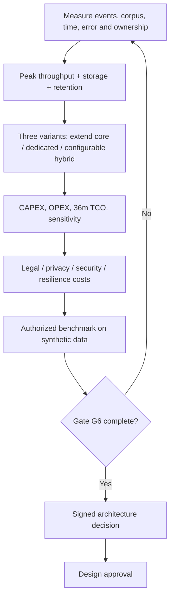

# SCH-11 · Economic and architecture decision

```mermaid
flowchart TD
 Baseline[Measure events, corpus, time, error and ownership] --> Forecast[Peak throughput + storage + retention]
 Forecast --> Three[Three variants: extend core / dedicated / configurable hybrid]
 Three --> Cost[CAPEX, OPEX, 36m TCO, sensitivity]
 Cost --> Risks[Legal / privacy / security / resilience costs]
 Risks --> POC[Authorized benchmark on synthetic data]
 POC --> Compare{Gate G6 complete?}
 Compare -->|No| Baseline
 Compare -->|Yes| ADR[Signed architecture decision]
 ADR --> G7[Design approval]
```
No production hardware procurement or Kubernetes deployment before sizing and approval.
